# wxl_claw

**OpenClaw AI 代理的桌面界面**

[功能](#功能) •
[为什么选择 wxl_claw](#为什么选择-wxl_claw) •
[快速开始](#快速开始) •
[架构](#架构) •
[开发](#开发)

[](https://github.com/45018051-wang/claw-cp/releases)
[](https://www.electronjs.org/)
[](https://react.dev/)
[](LICENSE)

[English](README.md) | [简体中文](README.zh-CN.md) | [日本語](README.ja-JP.md) | [Русский](README.ru-RU.md)

---

## 概述

**wxl_claw** 弥合了强大的 AI 代理与普通用户之间的差距。基于 [OpenClaw](https://github.com/OpenClaw) 构建，它将命令行 AI 编排转换为可访问的、美观的桌面体验——不需要终端。

无论您是在自动化工作流程、管理 AI 驱动的渠道，还是在调度智能任务，wxl_claw 都为您提供了有效利用 AI 代理所需的界面。

wxl_claw 预装了最佳实践的模型提供商，并原生支持 Windows 以及多语言设置。当然，您也可以通过 **设置 → 高级 → 开发者模式** 微调高级配置。

---

## 截图

| 仪表板 | 聊天 |
|-------|-----|
| 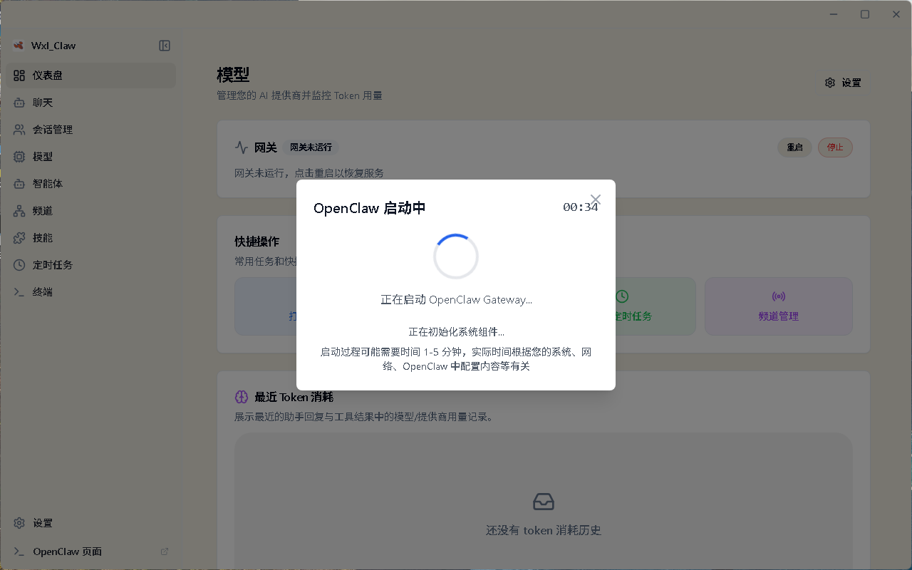 | 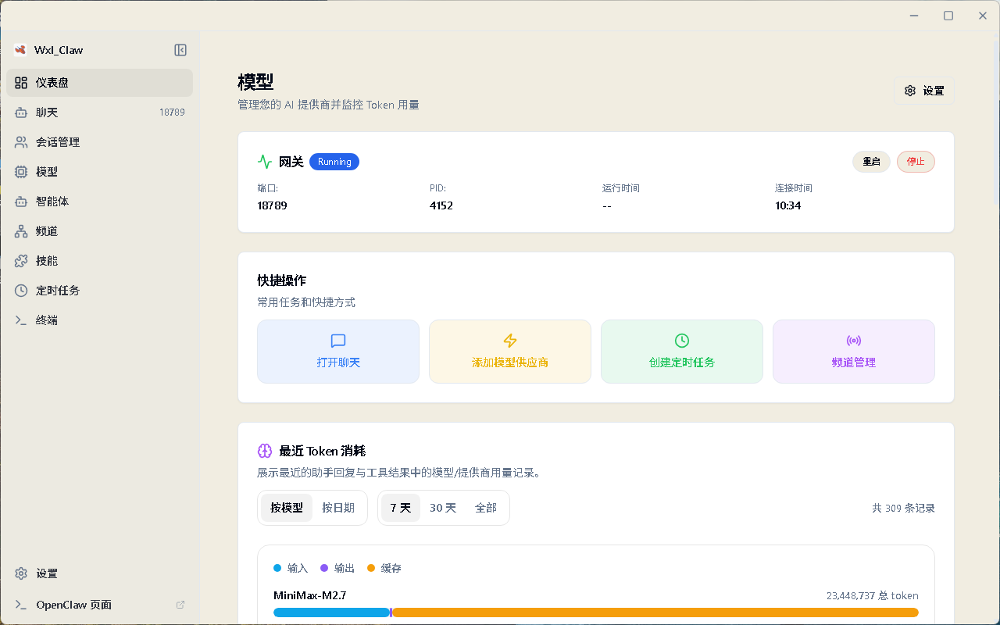 |

| 会话管理 | 模型 |
|---------|-----|
| 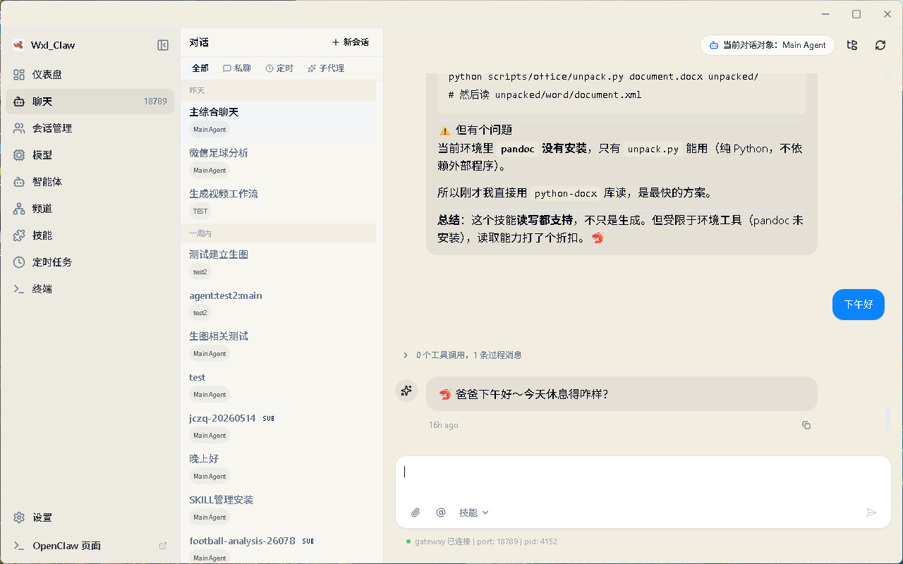 | 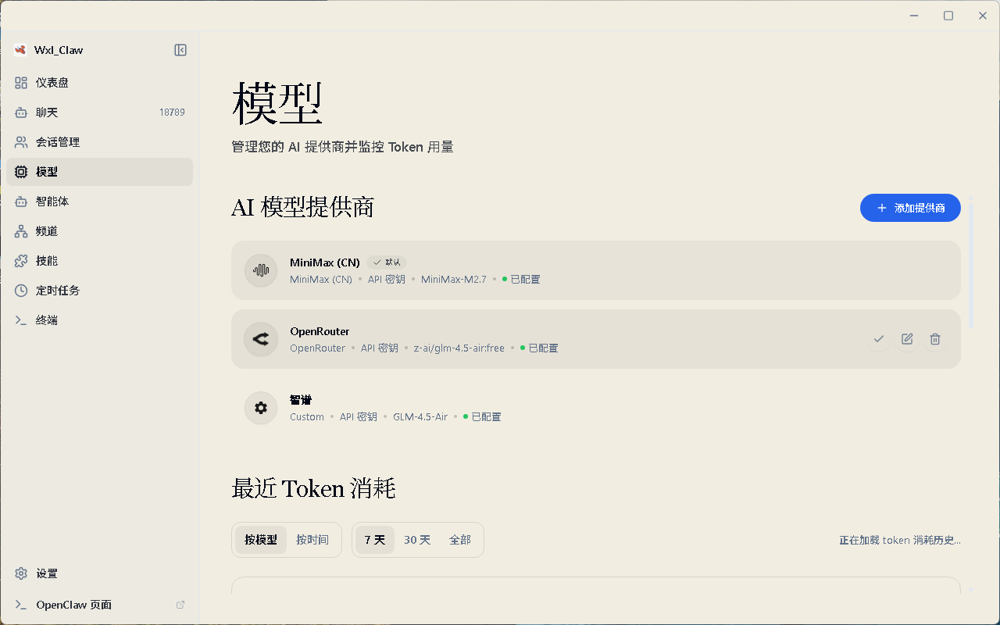 |

| 费用 | 代理 |
|-----|-----|
| 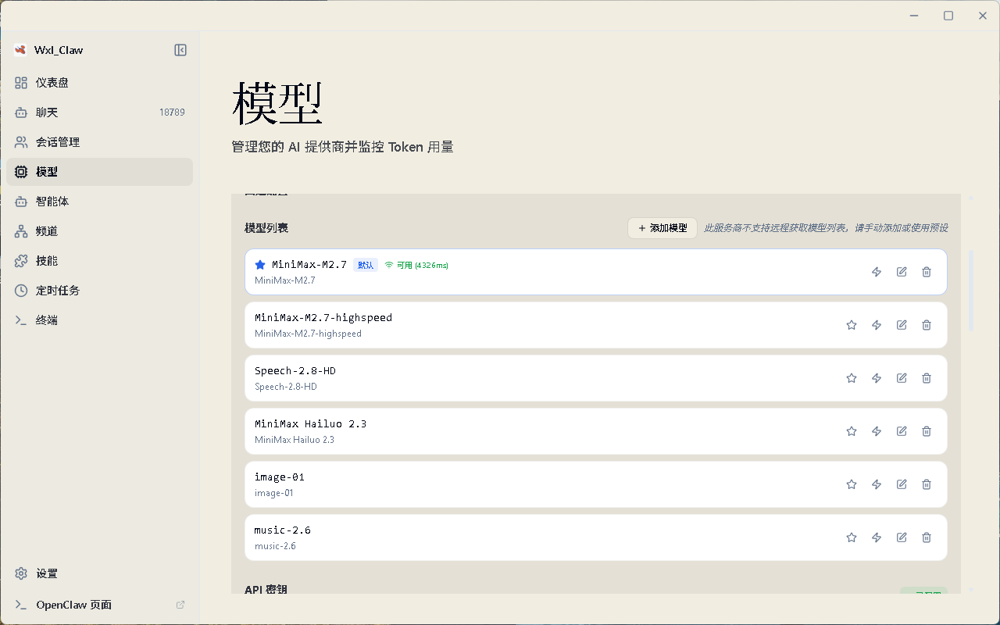 | 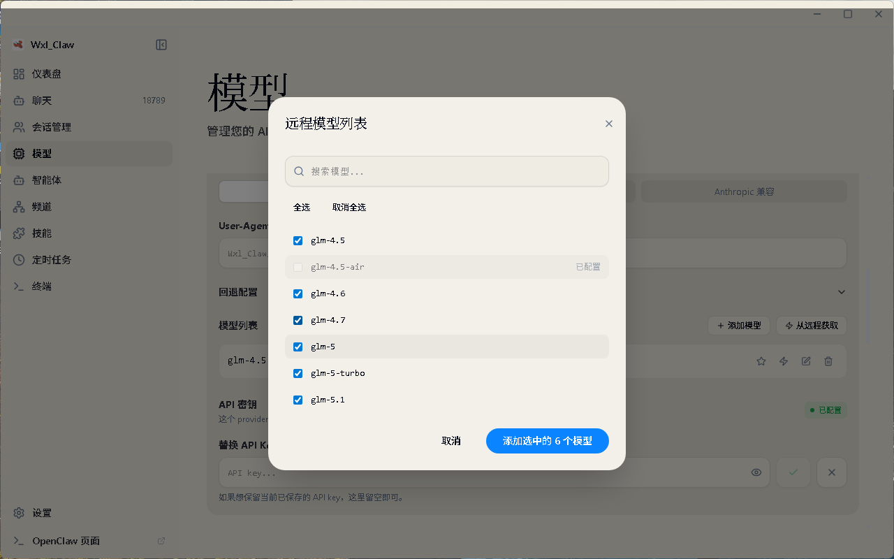 |

| 渠道 | 技能 |
|-----|-----|
| 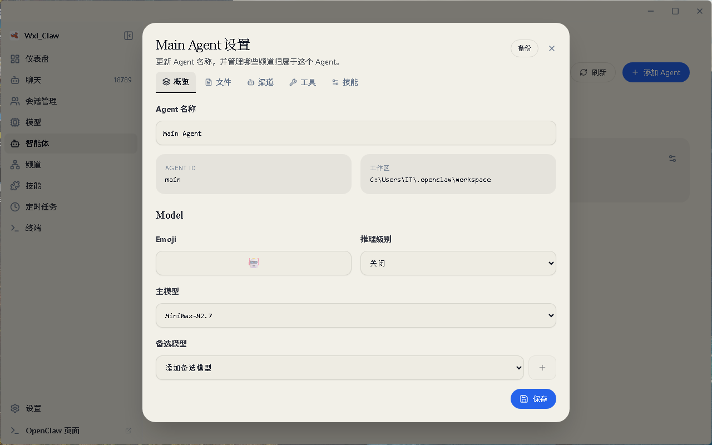 | 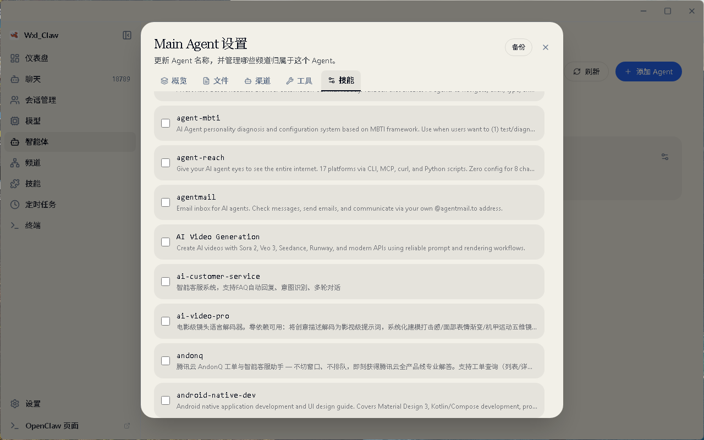 |

| 插件 | 设置 |
|-----|-----|
| 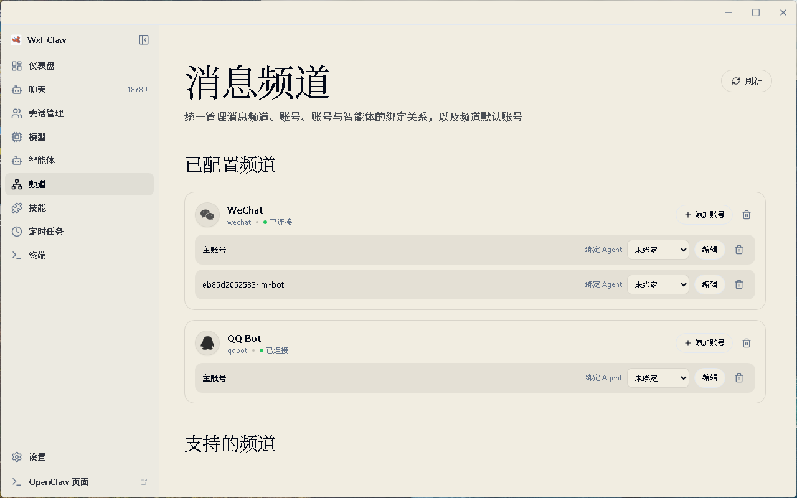 | 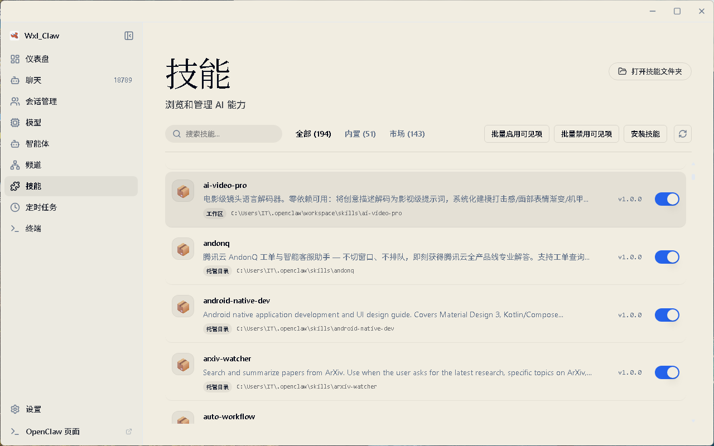 |

| Cron | 像素工作室 |
|------|----------|
| 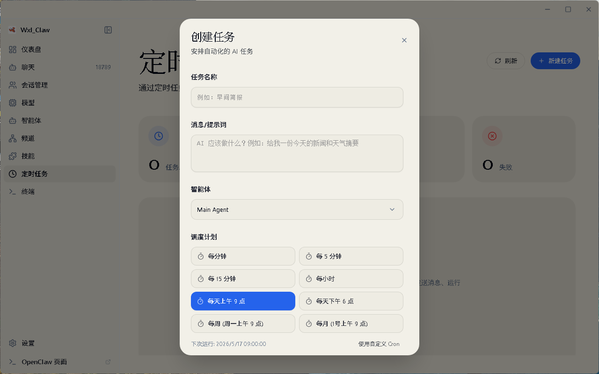 | 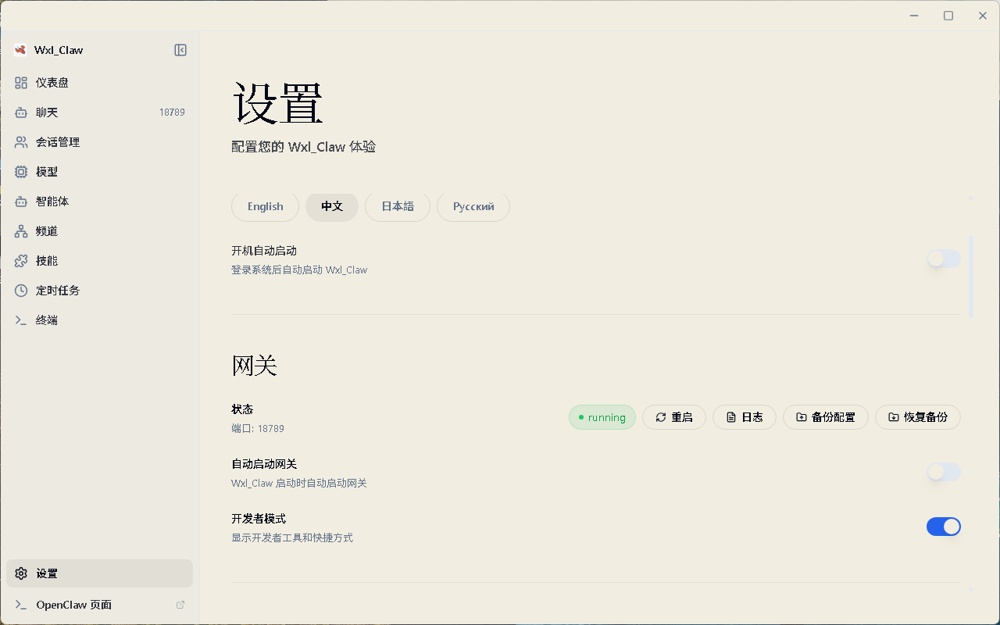 |

---

## 为什么选择 wxl_claw

构建 AI 代理不应该需要精通命令行。wxl_claw 基于一个简单的理念构建：**强大的技术理应拥有尊重您时间的界面**。

| 问题 | wxl_claw 解决方案 |
|-----|-----------------|
| 复杂的 CLI 设置 | 一键安装与引导式设置向导 |
| 配置文件 | 带实时验证的可视化设置 |
| 进程管理 | 自动网关生命周期管理 |
| 多个 AI 提供商 | 统一的提供商设置面板 |
| 技能/插件安装 | 内置技能市场和管理功能 |

### OpenClaw 内置

wxl_claw 直接基于官方 **OpenClaw** 核心构建。我们将运行时嵌入应用中，而不是单独安装，以提供无缝的、开箱即用的体验。

我们致力于与上游 OpenClaw 保持严格兼容性，确保您始终可以访问最新功能、稳定性改进和生态系统兼容性。

---

## 功能

### 🎯 零设置门槛

从安装到首次 AI 交互的一切都通过直观的图形界面完成。无需终端命令，无需 YAML 文件，无需寻找环境变量。

### 💬 智能聊天界面

通过现代聊天体验与 AI 代理交流。支持多个会话上下文、消息历史、丰富的 Markdown 渲染（包括 GitHub 风格的表格和通过 KaTeX 的 LaTeX 数学公式），以及在主输入字段中通过 `@agent` 直接路由到多代理配置。

### 📡 多渠道管理

同时配置和监控多个 AI 渠道。每个渠道独立运行，允许您为不同任务运行专门的代理。

### ⏰ 基于 Cron 的自动化

安排 AI 任务自动运行。定义触发器，设置间隔，让 AI 代理无需人工干预即可全天候工作。

### 🧩 可扩展的技能系统

使用预构建的技能扩展您的 AI 代理。从内置面板浏览、安装和管理技能——无需包管理器。

### 🔐 安全的提供商集成

连接到多个 AI 提供商（OpenAI、Anthropic 等），凭据安全存储在系统的原生密钥链中。OpenAI 同时支持 API 密钥和浏览器 OAuth（Codex 订阅）。

### 🌙 自适应主题

浅色模式、深色模式，或与系统同步。wxl_claw 自动适应您的偏好。

### 🚀 自动启动管理

在 **设置 → 通用** 中，您可以启用 **系统启动时启动**，让 wxl_claw 在您登录后自动启动。

---

## 快速开始

### 系统要求

- **操作系统**：macOS 11+、Windows 10+ 或 Linux（Ubuntu 20.04+）
- **内存**：最少 4 GB RAM（推荐 8 GB）
- **存储**：1 GB 可用磁盘空间

### 安装

#### 预构建版本（推荐）

从 [Releases](https://github.com/45018051-wang/claw-cp/releases) 页面下载适用于您平台的最新版本。

#### 从源代码构建

```bash
# 克隆仓库
git clone https://github.com/45018051-wang/claw-cp.git
cd claw-cp

# 初始化项目
pnpm run init

# 开发模式启动
pnpm dev
```

### 首次启动

当您首次启动 wxl_claw 时，**设置向导** 将引导您完成：

1. **语言和地区** — 设置您首选的语言和地区
2. **AI 提供商** — 添加带 API 密钥或 OAuth 的提供商（对于支持浏览器/设备登录的提供商）
3. **技能包** — 为常见场景选择预安装的技能
4. **验证** — 在进入主界面之前测试您的配置

如果支持，向导将预选您的系统语言，否则回退到英语。

### 代理设置

wxl_claw 包含内置代理设置，适用于 Electron、OpenClaw 网关或类似 Telegram 的渠道需要通过本地代理客户端访问互联网的环境。

打开 **设置 → 网关 → 代理** 并配置：

- **代理服务器**：所有请求的默认代理
- **绕过规则**：应直接连接的主机，用分号、逗号或换行分隔
- 在 **开发者模式** 中，您可以可选地覆盖：
  - **HTTP 代理**
  - **HTTPS 代理**
  - **ALL_PROXY / SOCKS**

推荐的本地设置示例：

```text
代理服务器: http://127.0.0.1:7890
```

注意事项：

- `host:port` 仅值被视为 HTTP
- 如果高级代理字段为空，wxl_claw 回退到 **代理服务器**
- 保存代理设置会立即重新应用 Electron 的网络配置并自动重启网关
- wxl_claw 还会在 Telegram 启用时将代理同步到 OpenClaw 的 Telegram 渠道配置
- 如果 wxl_claw 代理被禁用，在网关重启时会保留现有的 Telegram 渠道代理
- 要从 OpenClaw 的配置中显式清除 Telegram 代理，请在禁用代理的情况下保存代理设置
- 在 **设置 → 高级 → 开发者** 中，您可以运行 **OpenClaw Doctor** 来执行 `openclaw doctor --json` 并在不离开应用的情况下查看诊断输出

---

## 架构

wxl_claw 使用 **双进程架构和统一的 Host API 层**。渲染器调用单个客户端抽象，而 Electron Main 管理协议选择和进程生命周期。

### 设计原则

- **进程隔离**：AI 运行时在单独的进程中运行，即使在繁重的计算期间也能确保 UI 响应
- **前端单入口点**：渲染器调用通过 host-api/api-client 进行；协议细节隐藏在稳定接口后面
- **Main 中的传输所有权**：Electron Main 管理 WS/HTTP 使用和 IPC 回退以确保可靠性
- **优雅恢复**：内置重连、超时和回退逻辑自动处理临时故障
- **安全存储**：API 密钥和敏感数据使用操作系统的原生安全存储机制
- **CORS 安全设计**：本地 HTTP 访问通过 Main 代理，防止渲染器端的 CORS 问题

### 进程模型与网关故障排除

- wxl_claw 是一个 Electron 应用，因此 **一个应用实例通常显示为多个 OS 进程**（main/renderer/zygote/utility）。这是正常的。
- 单实例保护使用 Electron 的锁定加上本地进程锁定文件，防止在 IPC/会话总线不稳定的环境中重复启动应用。
- 混合旧/新版本的滚动升级可能会有不对称的保护行为。为了获得最佳可靠性，请将所有桌面客户端更新到相同版本。
- OpenClaw 网关监听器应该是 **唯一所有者**：只有一个进程应该监听 `127.0.0.1:18789`。
- 验证活动监听器：
  - macOS/Linux：`lsof -nP -iTCP:18789 -sTCP:LISTEN`
  - Windows (PowerShell)：`Get-NetTCPConnection -LocalPort 18789 -State Listen`
- 点击窗口关闭按钮（`X`）会将 wxl_claw 隐藏到托盘；这 **不会** 完全关闭应用。使用托盘菜单 **退出 wxl_claw** 来完全关闭。

---

## 使用场景

### 🤖 个人 AI 助手

配置一个通用的 AI 代理，它可以回答问题、起草邮件、总结文档并帮助处理日常任务——所有这些都通过简洁的桌面界面完成。

### 📊 自动化监控

设置定时代理来监控新闻源、价格或特定事件。结果交付到您首选的通知渠道。

### 💻 开发者生产力

将 AI 集成到您的开发工作流程中。使用代理进行代码审查、文档生成或自动化重复性编码任务。

### 🔄 工作流程自动化

将多个技能链接在一起，创建复杂的自动化管道。处理数据、转换内容和触发操作——所有这些都通过可视化编排。

---

## 开发

### 前置要求

- **Node.js**：22+（推荐 LTS）
- **包管理器**：pnpm 9+（推荐）或 npm

### 项目结构

```
wxl_claw/
├── electron/          # Electron 主进程
├── src/               # React 渲染器进程
├── tests/
│   ├── e2e/           # Playwright Electron E2E 冒烟测试
│   └── unit/          # Vitest 单元/集成测试
├── resources/         # 静态资源（图标、图像）
└── scripts/           # 构建/实用脚本
```

### 可用命令

```bash
# 开发
pnpm run init          # 安装依赖 + 下载 uv
pnpm dev               # 热重载启动（如果缺少则自动准备打包的技能）

# 代码质量
pnpm lint              # 运行 ESLint
pnpm typecheck         # TypeScript 类型检查

# 测试
pnpm test              # 运行单元测试
pnpm run test:e2e      # 使用 Playwright 运行 Electron E2E 冒烟测试

# 构建和打包
pnpm run build:vite    # 仅构建前端
pnpm build             # 完整生产构建（包括打包资源）
pnpm package           # 为当前平台打包（包括预安装的技能）
```

### 技术栈

| 层级 | 技术 |
|-----|-----|
| 运行时 | Electron 40+ |
| UI 框架 | React 19 + TypeScript |
| 样式 | Tailwind CSS + shadcn/ui |
| 状态 | Zustand |
| 构建 | Vite + electron-builder |
| 测试 | Vitest + Playwright |
| 动画 | Framer Motion |
| 图标 | Lucide React |

---

## 致谢

wxl_claw 建立在优秀的开源项目之上：

- [OpenClaw](https://github.com/OpenClaw) — AI 代理运行时
- [Electron](https://www.electronjs.org/) — 跨平台桌面框架
- [React](https://react.dev/) — UI 组件库
- [shadcn/ui](https://ui.shadcn.com/) — 精心设计的组件
- [Zustand](https://github.com/pmndrs/zustand) — 轻量级状态管理

---

## 许可证

wxl_claw 根据 [MIT 许可证](LICENSE) 发布。您可以自由使用、修改和分发此软件。

